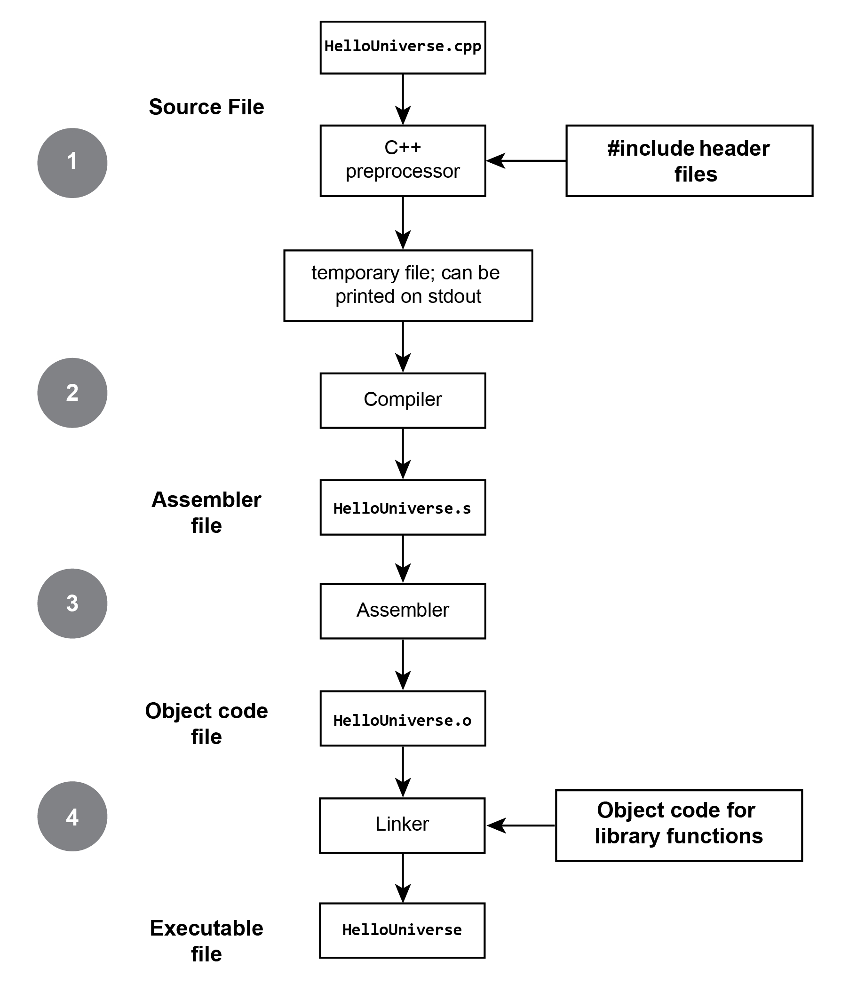

# Compiler vs Interpreter

## What is a compiler?

A compiler is a program that translates code written in a high-level programming language (like C, C++) into machine code, assembly language, or an intermediate form. Its primary purpose is to convert the abstract, human-readable code into a form that a computer's processor can execute directly.

The high-level programming languages are designed to be readable and understandable by humans, which allows for easier development, maintenance, and sharing of code among programmers. However, computers do not understand these high-level instructions. They only understand machine code, which is a set of binary instructions unique to each processor architecture.

### Compilation Process

1. **Source File**: This is the original code written by the programmer in a high-level programming language such as C or C++.

2. **Preprocessor**: Before actual compilation starts, the preprocessor takes the source code and deals with directives meant for it, like #include, #define, and #pragma. It essentially prepares the source code for compilation by performing text substitution, file inclusion, and conditional compilation. The output is a preprocessed file, which has a .i extension in the case of C.

3. **Compiler**: The compiler takes the preprocessed source code and translates it into assembly language. This step is where most of the optimization happens. The compiler also checks the syntax and semantics of the code and generates an assembly code file with a .s extension.

4. **Assembler**: The assembler is responsible for converting the assembly code into object code. Assembly language is still human-readable and needs to be turned into machine code that the computer can understand. The output of this phase is object code contained in .o or .obj files.

5. **Linker**: After all source files have been compiled and assembled into object files, the linker combines all the object files into a single executable file. It also handles the linking of library code and resolves symbolic references between object files. The final output is the executable file, which can be run on the computer.

### Advantages of Compilers

- **Efficiency**: Compiled programs generally run faster than interpreted ones because the conversion from source code to machine code is done beforehand.

- **No Dependency on Source Code**: Once compiled, the machine code is independent of the source code, providing privacy and security as the source is not needed to run the program.

- **Optimized Performance**: Compilers often optimize code during conversion, leading to more efficient and faster-executing programs.

### Disadvantages of Compilers

- **Compilation Time**: The process of compiling a large program can be time-consuming, potentially slowing down development and testing cycles.

- **Platform Dependency**: Compiled machine code is specific to the type of CPU and operating system for which it was compiled. This makes it less portable across different hardware environments.

- **Less Flexibility**: Once a program is compiled, making even minor changes requires recompiling the entire source code, which can be less convenient for rapid development and testing.

## What is an interpreter?

An interpreter is a program which also converts a high-level programming language (like 
Python, PHP, Perl) into machine code. Although similar to a compiler, the way that code is 
executed is different for both. Unlike a compiler that simply converts the source code to 
machine code, an interpreter can be run directly as an executable program. Contrary to a 
compiler, it converts source code to machine code when the program is running and not 
before the program runs.

Interpreters do not produce any intermediary object code like compilers. In interpreters, the 
source code is compiled and executed at the same time. It continues to translate the 
program until it encounters the first error after which it stops. Therefore, it is easy to debug. 
With interpreters, the source statements are executed line by line in contrast to a compiler 
that converts the whole program at once.

### Why use an interpreter if the compiler already exists?

The real need of interpreter comes where compiler fails to satisfy the software development 
needs. The compiler is a very powerful tool for developing programs in a high-level 
language. However, there are several demerits associated with the compiler. If the source 
code is huge in size, then it might take hours to compile the source code. Which will 
significantly increase the compilation duration. Here interpreter comes handy and can cut 
this huge compilation duration. Interpreters are designed to translate single instruction at a 
time and execute them immediately

An interpreter also comes handy when you frequently update the source code. As if it takes 
1 minut to compile the entire source code. If you have updated it 5 times. Then the total 
compile time would be 5 minutes which is significantly big. However, if we use an 
interpreter we can reduce this compile time.

## Compiled vs Interpreted

### Compiled Languages (e.g., C++)

- **Input**: A compiled language like C++ requires the entire program as input before it can begin processing.
- **Output**: It generates an intermediate object code or a machine code file which is executed by the operating system.
- **Working Mechanism**: The source code is compiled in advance, turning it into machine code, which can be executed repeatedly without the need for the original source code.
- **Speed**: Generally, compiled languages are faster because the code is directly translated into machine language, which the hardware can execute without further translation.
- **Memory**: They often require more memory because they generate an intermediate object code that must be stored.
- **Errors**: Errors are displayed after the entire program is compiled
- **Error Detection**: It can be more difficult due to the separation between compile time and runtime.
- **Languages**: Other languages that use compilers include C, C#, Go, ...

### Interpreted Languages (e.g., Python)

- **Input**: An interpreted language like Python can take a single line of code or instruction at a time for execution.
- **Output**: It does not produce an intermediate object code; it executes the source code directly.
- **Working Mechanism**: The source code is interpreted on the fly, line by line, which allows for interactive scripting and rapid prototyping.
- **Speed**: This line-by-line execution can be slower because each instruction must be translated into machine code at runtime.
- **Memory**: Interpreted languages typically require less memory because they do not create intermediate object code.
- **Errors**: Errors are displayed for each line as it is interpreted, which can make it easier to debug issues since you can see exactly where the program fails.
- **Languages**: Other interpreted languages include PHP, Perl, and Ruby.