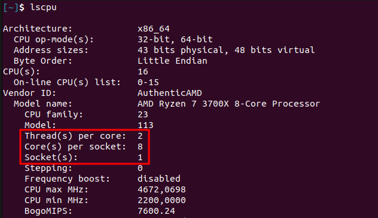
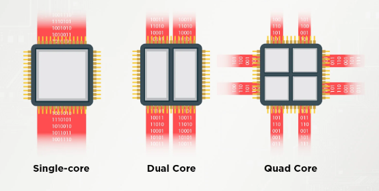
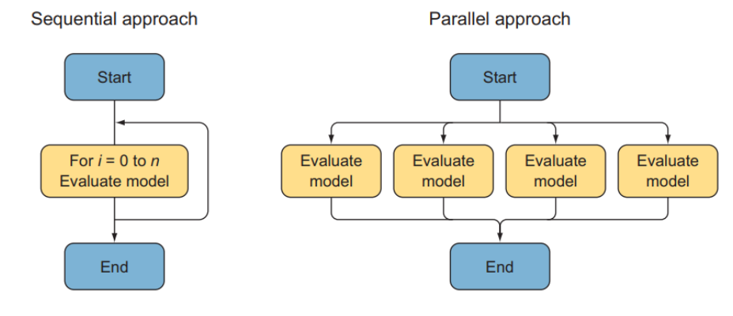
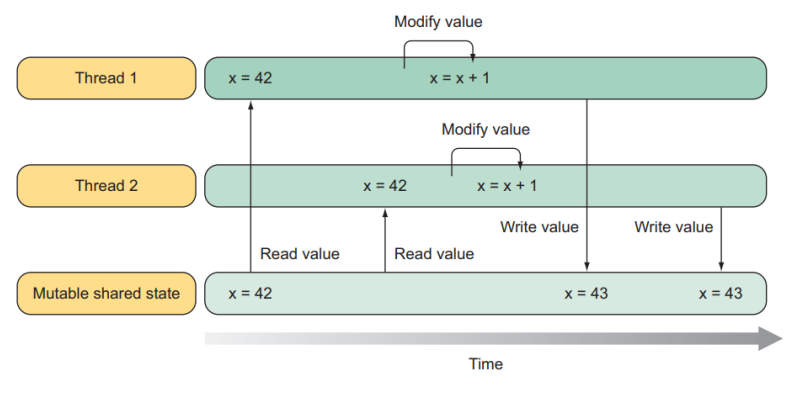
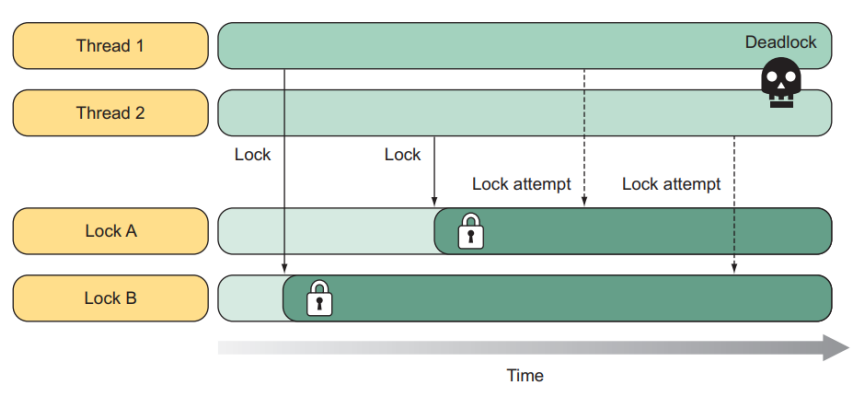

# Introduction To Concurrency

## Sequential and Asynchronous Programming 

**Process**: A program in execution

A program becomes a Process when it is loaded into a computer’s memory. A process has resources allocated to it such as registers, memory, etc. If you open multiple instances of an application, then each instance will be a separate process. A process has its own Virtual Memory and is self-contained. 
If one process become unresponsive then other processes are not impacted.

**Sequential programming**: is the act of accomplishing things in steps where one task must be completed before the next. One task at a time is performed in a specific order.

**Concurrency**: Doing more than one thing at a time.

I hope it’s obvious how concurrency is helpful. End-user applications use concurrency to respond to user input while writing to a database. 
Server applications use concurrency to respond to a second request while finishing the first request. You need concurrency any time you need an application to do one thing while it’s working on something else. Almost every software application in the world can benefit from con‐ currency.

**Asynchronous programming**: A form of concurrency that uses futures or callbacks to avoid unnecessary threads.

A future (or promise) is a type that represents some operation that will complete in the future. Asynchronous programming is centered around the idea of an asynchronous operation: a started operation that will complete a later time. While the operation is in progress, it doesn’t block the original thread; the thread that starts the operation is free to do other work. When the operation completes, it notifies its future or invokes its call‐ back or event to let the application know the operation is finished.

The async and await support in modern languages make asynchronous programming almost as easy as synchronous (non‐ concurrent) programming.
For example, while waiting at the coffee shop to prepare our cappuccino, we use our smartphone to check our emails. We’re doing two things at one time: waiting and using a smartphone.

**Reactive programming**: A declarative style of programming where the application reacts to events.

Reactive programming is closely related to asynchronous programming but is built on asynchronous events instead of asynchronous operations. Asynchronous events may not have an actual “start,” may happen at any time, and may be raised multiple times. One example is user input.

## Sockets, Cores and Threads

The `lscpu` command provides information about the CPU architecture. The output lists various details, including the number of CPUs, threads per core, cores per socket, and so on.

The output information describes the CPU architecture of the machine:

- **Socket(s): 1**: This shows that there's one CPU socket on the motherboard that has a CPU installed.

- **Core(s) per socket: 8**: This indicates that there are 8 physical cores in each CPU socket. A physical core is a complete processing unit, capable of executing its tasks independently.

- **Thread(s) per core: 2**: This means that each physical core has two threads. This is generally indicative of a feature known as Hyper-Threading (or Simultaneous Multi-Threading, SMT, in some AMD processors). Hyper-Threading allows each physical core to work on two tasks simultaneously, effectively doubling the number of logical cores.

## Threads

**Thread**: A basic unit of CPU utilization. There are numerous definitions of Thread found from different sources, some of them are listed out below.

- A thread is the smallest Unit of Execution.
- A thread is a sequence of instructions within a program that can be executed independently of other code. 
- A thread is an execution context, which is all the information a CPU needs to execute a stream of instructions. 
- A thread is a basic unit of CPU utilization; it comprises a thread ID, a program counter, a register set, and a stack. 
- A thread is a kernel abstraction for scheduling work on the processor, a thread is what the kernel gives you to manage the processor time and share work with others 

**More in depth:**

Thread is a light-weight Process. So, a thread basically points to a Process and uses the Code and Data saved in the Process. A thread will have its own Program Counter and Stack Pointer which will tell you where it is exactly in the Execution path. During Context Switching, instead of switching the whole Process, light-weight threads can be switched. Processes can have multiple threads, each with their own copy of Program counter and Stack Pointer. They still share the same Code and Data from the parent Process. Like PCB, the data structure that saves thread information is called the Thread Control Block (TCB). TBC is also saved in the Main memory. 

The thread is created by a process. Every time you open an application, it itself creates a thread which will handle all the tasks of that specific application. 

Threads have become a vital part of the computing as they allow the processor to perform multiple tasks at the same time making the tasks faster. And also making the computer capable of multitasking. Due to threads only you are able to browse the web as well as listen to music simultaneously. 

It shares with other threads belonging to the same process its code section, data section and other operating-system resources such as open files and signals.

### Types of threads 

**Foreground threads**: These have a direct impact on an application's lifetime. The application keeps running until there is a foreground thread. 

**Background threads**: These have no impact on the application's lifetime. When the application exits, all the background threads are killed. 

An application may comprise any number of foreground or background threads. While active, a foreground thread keeps the application running; that is, the application's lifetime depends on the foreground thread. The application stops completely when the last foreground thread is stopped or aborted. When the application exits, the system stops all the background threads

## Time Slicing and Context Switching

Time-slicing is a technique that divides CPU time among running processes, creating the impression of a multitasking or multi-programming environment. While Round Robin is a commonly used scheduling method to pick the next process in line, there are other scheduling algorithms like First-Come-First-Serve and Priority Scheduling that can also be used.

When it's time to switch from one process to another, the system performs a "**context switch**." This involves saving the current state of the process in a data structure known as the Process Control Block (PCB), which resides in the computer's main memory for quick access. The PCB contains essential information such as the Process ID, register states, program counter, and more.

Context switching can occur preemptively; for example, if a process is waiting for I/O to complete, it can be switched out before its time slice ends. This efficient use of CPU time enhances the user experience by allowing other processes to execute while the I/O-bound process waits.

Although saving and restoring the PCB involves some overhead, modern systems are generally optimized to minimize this impact, making the process relatively fast. Storing the PCB in the computer's main memory, rather than the hard disk, further accelerates the context switch because accessing main memory is much faster.

## Multi-Threading & Parallel Processing 

### Multi-threading

**Multi-threading**: A Way to Achieve Concurrency

**Definition**: Multi-threading is an approach to executing multiple tasks or processes concurrently but not necessarily simultaneously. In a single-threaded application, tasks are performed one after the other. In a multi-threaded environment, you have more than one thread running within the same application, potentially improving efficiency and performance.

**How It Works**: Threads within the same application share the same memory space, making it easier to share data between threads. However, this sharing can also lead to complexities like race conditions, where the program's behavior depends on the relative timing of events, such as threads' execution.

**Example**: Imagine a web server handling multiple incoming client requests. Using multi-threading, each client request can be handled by a separate thread, all within the same server process. This enables the server to efficiently process multiple client requests even if some requests are waiting for I/O operations like database access or file reads.

**Key Point**: Multi-threading is primarily concerned with maximizing the efficiency of a single application by dividing it into smaller, concurrently executing tasks (threads).
### Parallel Processing: A Form of Concurrency Across Multiple Cores

**Definition**: Parallel processing is a technique used to perform multiple computations simultaneously, taking full advantage of multi-core CPUs. It often employs multi-threading but is focused on parallel execution, not just concurrent execution.

**How It Works**: In parallel processing, tasks are divided into sub-tasks that are distributed across multiple threads. These threads can run simultaneously on different CPU cores, speeding up the overall execution time of a task.

**Example**: Consider a large dataset that you want to sort. Rather than sorting it sequentially, you can divide it into smaller chunks and sort each chunk simultaneously using different threads running on separate CPU cores. Once all chunks are sorted, you can merge them to get the final sorted dataset.

**Key Point**: Parallel processing aims to maximize the overall system throughput and is often more concerned with distributing tasks across multiple cores or even multiple machines.
#### Summary

- **Multi-threading**: Focuses on achieving concurrency within a single application. It's like a busy chef who is chopping vegetables while keeping an eye on a boiling pot.

- **Parallel Processing**: Focuses on splitting tasks to be run simultaneously across multiple CPU cores for faster completion. It's like having multiple chefs, each assigned to a specific task, all cooking at the same time to prepare a large feast more quickly.

## Why multi-threading?

#### Improved Responsiveness

In applications that require constant user interaction, multi-threading can improve responsiveness. For example, in a graphical user interface (GUI), one thread (commonly known as the UI thread) can be dedicated to listening for user inputs, while another thread performs more time-consuming tasks in the background. This ensures that the application remains responsive to the user at all times.

#### Efficient CPU Utilization

Multi-threading can also make better use of the CPU by ensuring that it's almost always working on some task. When one thread encounters an I/O-bound operation that doesn't require CPU cycles, the CPU can shift its focus to another thread that does require computation. This minimizes CPU idle time and maximizes utilization.

#### Seamless Resource Sharing

Threads within the same process can share resources like code segments, data, and files more easily because they operate in the same memory space. This makes inter-thread communication more straightforward and faster compared to inter-process communication, which often involves more complex mechanisms like message passing or shared memory spaces.

#### Lower Overhead Costs

Thread management—comprising thread creation, termination, and context switching—is generally more resource-efficient than process management. This is because threads within the same process share resources, reducing the overhead associated with these operations.

#### Enhanced Scalability

Multi-threaded applications can more readily take advantage of systems with multiple processors or cores. By spreading tasks across available processors, multi-threading can significantly boost the application's throughput. This makes it highly scalable and well-suited for scenarios ranging from single-user desktop applications to large-scale server applications.

## Thread Safety / Resources Synchronization

### The Race Condition 

Threads within the same process can access common resources like data and code. However, this can lead to issues if multiple threads try to modify the same data simultaneously. This situation, known as a "**race condition**", creates uncertainty about which thread will get to modify the data first.

The part of the code where this can happen is called a "**critical section**." In these sections, even a single line of code can become multiple lines when compiled, making it non-atomic, or indivisible. This means that the outcome can change based on the order in which threads run this code.

To prevent these issues, you can use "**thread synchronization**" techniques. These ensure that only one thread can access the critical section at a time, blocking others until it's done. Common methods for achieving this include using semaphores, monitors, and locks.

#### Example: 

Two threads (Thread 1 and Thread 2) run in parallel, both trying to access and modify the shared value x. If Thread 2 tries to read from the same memory location while Thread 1 writes back an updated value, the value of x changes. This result is data corruption or race condition.

### Deadlocks

When a program has both changeable data (mutable state) and runs tasks in parallel, it's a recipe for trouble. In traditional programming approaches, one way to safeguard the mutable data is to use locks, allowing only one thread to access the data at any given time. This is known as "mutual exclusion," because when one thread is accessing a particular piece of data, all other threads are excluded from doing so.

Timing is crucial here. For mutual exclusion to be beneficial, multiple threads should ideally need to access the same data simultaneously. While using locks can prevent data corruption, it also creates new challenges, such as the risk of deadlock. In a deadlock situation, two or more threads each wait for the other to release a lock, leading to a standstill where nothing can proceed.

#### Example

1. Thread 1 acquires lock B 
2. Thread 2 acquires lock A 
3. Thread 1 tries acquiring lock A 
   (failed because not released by thread 2) 
4. Thread 2 tries acquiring lock B 
   (failed because not released by thread 2) 
5. This is a case of deadlock.

When multiple threads need to access and modify shared data, performance can take a hit due to the need for synchronization. Mutual exclusion locks, or **mutexes**, are often used to ensure that only one thread at a time can access certain parts of the code. While these locks can prevent data corruption, they come with a downside: they slow everything down.

Each time a thread acquires or releases a lock, it incurs a performance cost. As the number of processor cores increases, this cost can escalate, because more threads might be waiting for the same lock. Additionally, as you add more tasks that need to access the same shared data, the overhead from using locks becomes a bigger issue, negatively affecting overall performance.