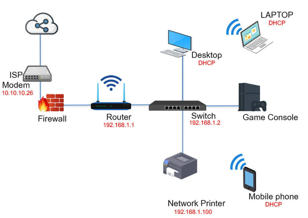

# Introduction to Networking

Networking involves the interconnection of multiple devices (known as hosts) to transmit, exchange, and receive data and resources. This interconnection can be achieved through wired or wireless means and enables devices to communicate over various distances.

## Networking Hardware

### Internet Service Providers (ISPs)

- **Function**: ISPs are companies that provide individuals and organizations access to the Internet.

- **Services**: Beyond just internet access, many ISPs also offer related services such as web hosting, email hosting, and domain registration.

- **Connectivity Methods**: They use various technologies to deliver internet connectivity, including DSL (Digital Subscriber Line), cable modem, fiber optics, satellite, and wireless connections.

### Modems

- **Primary Function**: A modem (short for modulator-demodulator) is a device that a acts as a translator between the digital world of computers and the analog world of cable networks.
  
- **ISP Connection**: The modem connects a user's local network to their Internet Service Provider (ISP). It serves as the initial entry point to the internet from a home or office network.

### Routers

- **Function**: Routers are devices that route data packets between different networks. They determine the best path for data to travel across networks to reach their destination.

- **Features**: Routers typically include features like NAT, DHCP services, and firewall protection.

### Switches and Hubs

- **Function**: Switches are used within a network to connect various devices like computers, printers, and servers, creating a local area network (LAN).

- **Types**: Managed and unmanaged switches, with the former offering greater control over network traffic.

**Hub**: A basic networking device that connects multiple Ethernet devices, making them act as a single network segment. When a hub receives data, it sends it to all connected devices, regardless of the intended recipient.

### Wireless Access Points (WAPs)

- **Function**: WAPs allow wireless-capable devices to connect to a wired network using Wi-Fi or Bluetooth.
  
- **Deployment**: Used in both home and business networks to expand wireless network coverage.

### Network Interface Cards (NICs)

- **Function**: A hardware component, either integrated into the motherboard or added as an expansion card, that enables a computer or device to connect to a network.

- **Types**: Different NICs are available for wired (Ethernet NIC) and wireless (Wi-Fi NIC) connections.

### Network Cabling and Wireless Technology

#### Ethernet Cables (Twisted Pair Cables):

- **Cat5, Cat5e**: Supports up to 1 Gbps; Cat5e reduces interference.
- **Cat6, Cat6a**: Higher performance, up to 10 Gbps, with Cat6a supporting longer distances.
- **Cat7**: High frequency, supporting 10 Gbps over 100 meters.
- **Usage**: Common in local area networks (LANs) for connecting computers, routers, and switches.

#### Fiber Optic Cables:

- **Function**: Use light to transmit data, offering high speeds and long-distance transmission.
- **Types**:
  - **Single-mode fiber**: For long-distance, high-speed transmission, suitable for WANs.
  - **Multi-mode fiber**: For shorter distances, used in LANs.
- **Advantages**: High bandwidth, long-distance capability, and immunity to electromagnetic interference.
- **Applications**: Ideal for backbone networks and data centers where high data rates are required.

#### Coaxial Cables:

- **Design**: Central metal conductor, insulator, metal shield, and plastic covering.
- **Use**: Common for cable TV and internet services.

#### Wi-Fi Standards

- **Explanation**: Wi-Fi standards are set by the IEEE (Institute of Electrical and Electronics Engineers) and include 802.11a, b, g, n, ac, and ax.
- **Differences**: Each standard differs in terms of speed, range, frequency, and capacity, with newer standards offering improvements over the previous ones. For example, 802.11ac provides faster speeds and better range than 802.11n.

## Network Types

### Local Area Network (LAN)

- **Definition**: A LAN connects computers and devices within a relatively small and specific area like a home, office, or building. 
- **Characteristics**: 
  - High data transfer rates.
  - Usually owned, controlled, and managed by a single person or organization.
  - Networking devices used include routers, switches, and hubs.
  - Common technologies: Ethernet for wired LANs, Wi-Fi for wireless LANs.

### Wide Area Network (WAN)

- **Definition**: A WAN covers a broader geographical area, often comprising multiple cities, countries, or even continents. For example, businesses with many international branch offices use a WAN to connect office networks together. The world’s largest WAN is the internet because it is a collection of many international networks that connect to each other.
- **Characteristics**:
  - Connects multiple LANs, typically through the internet.
  - Slower data transfer rates compared to LANs due to the larger distances.
  - Usually owned and managed by multiple organizations or service providers.
  - Common uses include enterprise networks, government networks, and the internet itself.

### Metropolitan Area Network (MAN)

- **Definition**: A MAN spans a larger area than a LAN but is usually confined to a city or a metropolitan area.
- **Characteristics**:
  - Designed to extend over an entire city or metropolitan area.
  - Often used to connect multiple LANs within a city to share resources or for internet connectivity.
  - Higher capacity than LAN and typically operated by a single entity or service provider.

### Virtual Private Network (VPN)

- **Definition**: A VPN extends a private network across a public network, enabling users to send and receive data as if their devices were directly connected to the private network.
- **Characteristics**:
  - Provides secure and encrypted connections for greater privacy.
  - Allows remote users secure access to their organization's network.
  - Commonly used for secure communications, especially for remote work.

### Virtual LANs (VLANs)

- **Definition**: A VLAN is a subcategory of LAN which groups together a collection of devices from different physical LANs to form a single broadcast domain.
- **Characteristics**:
  - VLANs are configured through software rather than hardware, making them extremely flexible.
  - Enhances network efficiency and security by segmenting networks into smaller parts.
  - Useful in large organizations for separating different departments or types of traffic, like separating voice and data traffic.

## Data Transmission Methods:

In networking, data transmission methods are crucial in determining how information is distributed across the network. These methods include unicast, broadcast, and multicast, each serving different purposes based on the network's needs.

### Unicast

- **Definition**: Unicast is a one-to-one transmission method where data is sent from one sender to one specific receiver.
- **Characteristics**:
  - **Direct Communication**: Data packets are sent directly to a specific destination IP address.
  - **Efficiency in Point-to-Point Communication**: Ideal for direct communication between two devices, like a client-server interaction.
  - **Traffic Control**: Since data is sent to a specific destination, unicast does not consume unnecessary network bandwidth.
- **Use Cases**: Common in most internet communications, such as web browsing, email, and file transfers.

### Broadcast

- **Definition**: Broadcast is a one-to-all transmission method where data is sent from one sender to all possible receivers within the network or a network segment.
- **Characteristics**:
  - **Network-Wide Communication**: Data packets are sent to all devices on the network.
  - **No Specific Destination Address**: The destination address is typically set as the broadcast address (e.g., `255.255.255.255` in IPv4), indicating all nodes.
  - **Best Effort Delivery**: There is no acknowledgment from the receiving devices.
- **Use Cases**: Used for network-wide announcements or services discovery, like DHCP requests to find a DHCP server when a device first connects to a network.

### Multicast

- **Definition**: Multicast involves sending data from one sender to multiple selected receivers simultaneously.
- **Characteristics**:
  - **Group Communication**: Data is sent to predefined groups of hosts. Each group is identified by a specific multicast IP address.
  - **Efficient Use of Bandwidth**: Multicast reduces the bandwidth usage by simultaneously delivering a single stream of data to multiple recipients.
  - **Controlled Reception**: Only devices that have joined the multicast group will receive the data.
- **Use Cases**: Common in streaming media (like IPTV), online gaming, and real-time applications where the same data needs to be delivered to multiple recipients.

## Understanding IP Addresses and Ports

### IP Addresses

An IP (Internet Protocol) address is a unique identifier assigned to each device on a network. It's akin to a postal address for computers, ensuring that data sent across a network reaches the correct destination.

#### There are two types of IP addresses:

- **IPv4**: Consists of four sets of numbers separated by periods, e.g., 192.168.1.1. It uses a 32-bit address space.

- **IPv6**: Developed to deal with the shortage of IPv4 addresses. It uses 128-bit addressing, allowing for a significantly larger number of devices, and is represented in hexadecimal format, e.g., 2001:0db8:85a3:0000:0000:8a2e:0370:7334.

#### Types of IPv4 Addresses:

- **Public vs Private**: 
- Public IP addresses are globally unique and accessible over the internet, whereas private IP addresses are used within local networks (LANs) and are not directly accessible from the internet.
- **Private Address Ranges**:
  - `10.0.0.0 to 10.255.255.255 (10.x.x.x)`: Class A private range, used for large networks.
  - `172.16.0.0 to 172.31.255.255 (172.x.x.x)`: Class B private range, used for medium-sized networks.
  - `192.168.0.0 to 192.168.255.255 (192.x.x.x)`: Class C private range, commonly used in small networks like home LANs.

Configuring your network to use one of the private IP ranges (`10.x.x.x`, `172.x.x.x`, or `192.x.x.x`) involves setting up your network devices (like routers and switches) and assigning IP addresses to your devices within those ranges.

### Ports

In networking, a port is a virtual point where network connections start and end. Ports are associated with the IP address of the host and the type of protocol used for communication. They help to differentiate between multiple processes or services running on the same computer.

There are a total of 65535 TCP and UDP ports available. Ports are divided into three ranges:
- **Well-Known Ports**: 0 to 1023, reserved for well-known services:
  - FTP: 20 (Data Transfer)
  - SSH: 22, for secure shell access
  - SMTP: 25, for email transmission
  - HTTP: 80, for web traffic
  - HTTPS: 443, for secure web traffic
- **Registered Ports**: 1024 to 49151, can be registered for services.
- **Dynamic or Private Ports**: 49152 to 65535, typically used for client-side communication.

### MAC Addresses

A **MAC (Media Access Control)** address is a hardware identifier that uniquely identifies each device on a network. It's a physical address embedded into the network interface card (NIC) of the device and is used for network communication at the data link layer of the OSI model.

A MAC address is a 48-bit number, usually represented in hexadecimal format, e.g., 00:1A:C2:7B:00:47.
Unlike IP addresses, which can change depending on the network, MAC addresses are usually fixed and unique to the device.

## Domain Name System (DNS)

The Domain Name System (DNS) is a critical component of the internet's infrastructure. It acts like a phonebook for the internet, translating human-readable domain names (like `www.example.com`) into machine-readable IP addresses (like 1`92.0.2.1`). This translation is essential because while domain names are easy for people to remember, computers and networks rely on IP addresses to locate and identify each other on the internet.

### How DNS Works:

1. **Query Initiation**: When you type a URL into your browser, your computer sends a DNS query to find the IP address associated with the domain name.
2. **Recursive and Iterative Queries**: The query usually goes through several stages, moving from recursive to iterative queries, involving various DNS servers, including local DNS servers, root name servers, TLD (Top-Level Domain) name servers, and authoritative name servers.
3. **Response**: The final authoritative DNS server returns the IP address of the domain, allowing your browser to establish a connection to the web server hosting the website.
DNS is vital for the user-friendly navigation of the internet, making it possible to connect to websites without needing to memorize IP addresses.

DNS is vital for the user-friendly navigation of the internet, making it possible to connect to websites without needing to memorize IP addresses.

## Dynamic Host Configuration Protocol (DHCP)

DHCP stands for Dynamic Host Configuration Protocol. It is used on IP networks to automatically assign IP addresses and other network configuration parameters to devices (like computers, printers, etc.) so they can communicate on an IP network.

### How DHCP Works:

1. **IP Address Assignment**: When a device connects to a network (e.g., when you turn on your computer or connect to Wi-Fi), it broadcasts a request for an IP address.
2. **DHCP Server Response**: A DHCP server on the network receives this request and assigns an available IP address from its pool of IPs, along with other network configuration details like subnet mask, default gateway, and DNS server addresses.
3. **Lease Time**: The IP address is leased for a certain period. The device must renew the lease to keep using the IP address.

### Static vs Dynamic IP Addresses

- **Static IP Address**:
  - Does not change.
  - Manually configured and set on the device.
  - Useful for servers or devices needing a constant IP address.

- **Dynamic IP Address**:
  - Assigned by a DHCP server and can change over time.
  - Easier to manage, especially on large networks.
  - Reduces the risk of IP address conflicts.

### Network Protocols:

Network protocols are sets of rules and standards that define how data is transmitted and received over a network. These protocols ensure that devices on a network can communicate effectively, regardless of their underlying architecture or design. Here's an overview of some very common network protocols:

### HTTP (Hypertext Transfer Protocol)

- **Purpose**: The protocol used for transferring web pages on the internet.
- **Functionality**: HTTP defines how messages are formatted and transmitted, and how web servers and browsers should respond to various commands.

### HTTPS (HTTP Secure)

- **Purpose**: HTTPS is used for secure communication over the internet. Its primary goal is to protect the confidentiality and integrity of data transmitted between a user's browser and a web server.
- **Functionality**: HTTPS achieves its security through encryption, authentication and data integrity.

 ### SSH (Secure Shell)

- **Purpose**: Provides a secure channel over an unsecured network, primarily for logging into a networked computer and executing commands.
- **Functionality**: SSH uses encryption to ensure that the communication remains confidential and secure from unauthorized access.

### FTP (File Transfer Protocol)

- **Purpose**: Used for transferring files between a client and a server on a network.
- **Functionality**: FTP allows users to upload, download, delete, and manage files on a remote server.